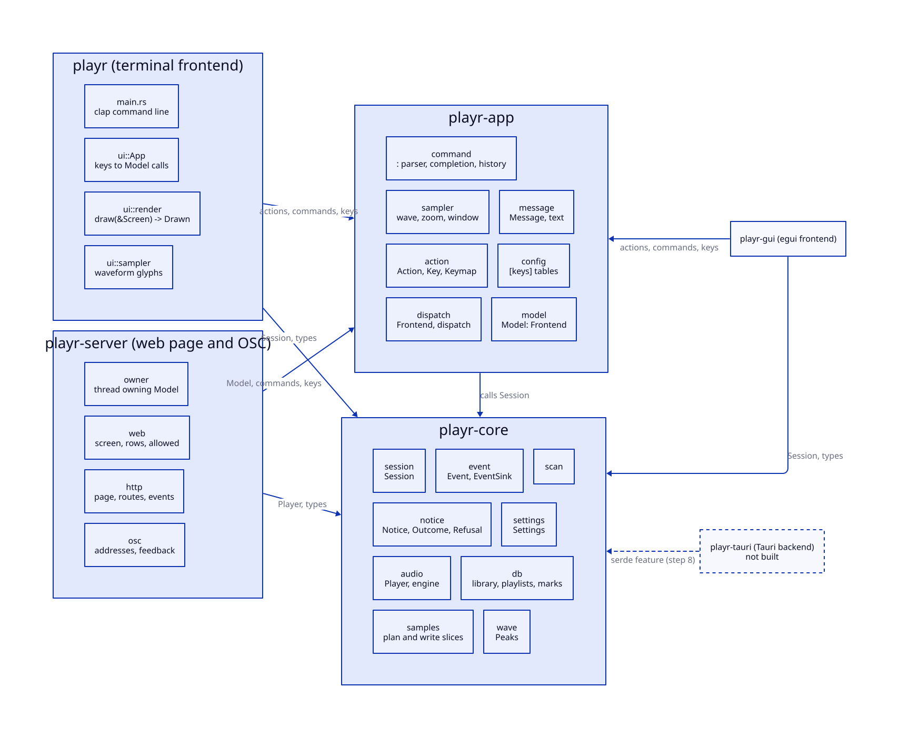
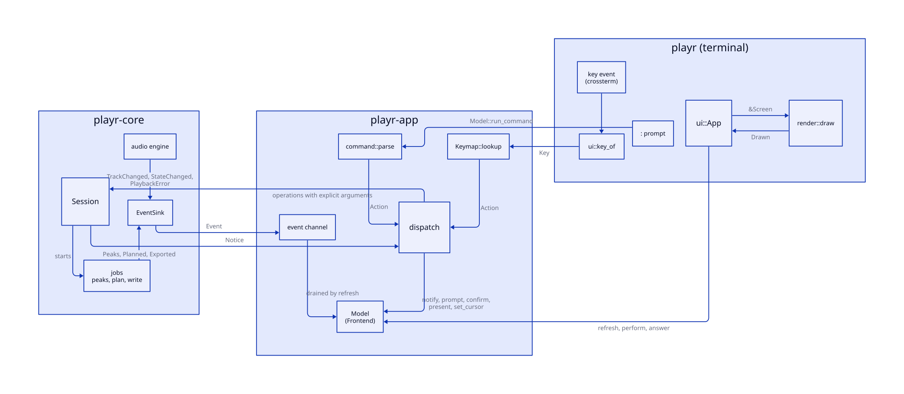

# One core, several frontends

Design note, current as of playr 0.7.0. Steps 1 to 7 of the split are done; step 8 is deferred. The frontends are the terminal and the desktop window, `playr-gui`.

The goal: the terminal interface is one frontend of a core that an egui app or a Tauri app could also drive. Everything but presentation is shared.

## What each frontend needs

The two candidates put different demands on the core. The design takes the stricter demand at every point, so either can be built.

| | egui | Tauri |
|-|-|-|
| language of the view | Rust, in process | JavaScript or TypeScript, over IPC |
| shares Rust types with the core | yes | no; values cross IPC as JSON |
| frame loop | yes; redraws continuously or on request | no; the page reacts to events |
| owner of the core | the app struct, on one thread | Tauri's state, shared by command threads |
| can call the core's formatting | yes | no |

So the core:

1. Depends on no presentation crate: no `ratatui`, `crossterm`, `egui` or `tauri`.

2. Takes explicit arguments. An operation names what it acts on, by track, index, id or path, never "the row under the cursor".

3. Returns data, not text. Outcomes and refusals are enums; a frontend words them.

4. Pushes events. Work that finishes later, and changes a frontend did not cause, reach it through one sink. A frame loop may also poll.

5. Is `Send`. A Tauri app wraps `Session` in a `Mutex`; an egui app owns it.

6. Serialises behind a cargo feature, `serde`, which only a Tauri or daemon frontend turns on. Not built yet; see step 8.

## Crates

```
playr         terminal frontend  ---+
playr-gui     egui frontend      ---+--> playr-app --> playr-core
playr-tauri   Tauri backend      -----------------> playr-core [serde]
```



The Rust frontends also depend on `playr-core` directly, for `Session` and the types `dispatch` passes; the arrows show only where each frontend gets its interaction from. `playr-gui` is described in `docs/dev/gui.md`; `playr-tauri` does not exist. `[serde]` is step 8.

- **playr-core** (`crates/playr-core`): `audio`, `db`, `scan`, `samples`, `wave`, `notice`, `event`, `session` and `settings`. No presentation dependency.

- **playr-app** (`crates/playr-app`): what Rust frontends share about interaction. `action` (`Action`, `Key`, `Keymap`), `command` (the `:` parser, completion, history), `config` (the `[keys]` tables), `message` (messages and their words), `dispatch`, `model` (the interface's state) and `sampler` (the sampler view's state and column geometry). It is optional: a Tauri frontend skips it, or uses its parser on the Rust side for a command palette.

- **playr-gui** (`crates/playr-gui`): the desktop window, with egui. It wraps `Model` as the terminal does.

- **playr** (the root crate): the terminal. The command line in `src/main.rs`, and `src/ui`: `App` over the shared `Model`, key handling, drawing and the sampler's glyphs.

Views (library, selection, playlists, sampler) are a presentation idea, so they are not in the core. `playr_app::View` names them as scopes for key bindings and view-scoped commands; a GUI maps its panels or focus onto them, or ignores them.

## playr-core

### Session

`playr_core::session::Session` owns the library connection, the player, the loaded library, the selection, marks and background jobs. It is the only way a frontend changes them. The caller opens the connection and the player; `Session::new(conn, player, events)` hands the sink to the player.

```rust
impl Session {
    pub fn new(conn: Connection, player: Player, events: EventSink) -> Session;
    pub fn set_samples_dir(&mut self, dir: PathBuf);
    pub fn reload(&mut self);

    // Library
    pub fn tracks(&self) -> &[Track];
    pub fn playlists(&self) -> &[Playlist];
    pub fn search(&self, input: &str) -> Vec<Track>;
    pub fn playlist_tracks(&self, id: i64) -> Vec<Track>;
    pub fn has_library_file(&self) -> bool;
    pub fn set_library_path(&mut self, path: PathBuf);                  // the file a scan writes to

    // Playback
    pub fn player(&self) -> &Player;                  // status, position, levels, queue
    pub fn play(&mut self, tracks: &[Track], index: usize);
    pub fn send(&self, cmd: Cmd);                     // pause, next, seek, volume, speed
    pub fn volume_by(&self, delta: f32);
    pub fn set_mode(&self, mode: Mode) -> Notice;
    pub fn cycle_mode(&self, forward: bool) -> Notice;
    pub fn play_playlist(&mut self, id: i64) -> Notice;
    pub fn play_playlist_named(&mut self, name: &str) -> Notice;
    pub fn playing_track(&self) -> Result<(PathBuf, u32), Refusal>;

    // Selection
    pub fn selection(&self) -> &[Track];
    pub fn set_selection(&mut self, tracks: Vec<Track>);
    pub fn toggle_selected(&mut self, track: Track) -> Outcome;
    pub fn add_playlist_to_selection(&mut self, id: i64) -> Option<Outcome>;
    pub fn remove_from_selection(&mut self, index: usize) -> Option<Outcome>;
    pub fn move_in_selection(&mut self, index: usize, by: i64) -> Option<usize>;
    pub fn clear_selection(&mut self) -> Outcome;

    // Playlists
    pub fn check_save(&self) -> Result<(), Refusal>;
    pub fn save_selection(&mut self, name: &str, replace: bool) -> Notice;
    pub fn rename_playlist(&mut self, id: i64, name: &str) -> Notice;
    pub fn delete_playlist(&mut self, id: i64) -> Option<Notice>;

    // Marks, on the playing track
    pub fn marks_for(&mut self, path: Option<&PathBuf>) -> &[Mark];
    pub fn add_mark(&mut self, at: Option<Duration>) -> Notice;
    pub fn undo_mark(&mut self) -> Notice;
    pub fn marks_to_clear(&mut self) -> Result<(PathBuf, usize), Refusal>;
    pub fn clear_marks(&mut self, path: &Path) -> Option<Notice>;
    pub fn seek_to_mark(&mut self, forward: bool) -> Notice;

    // Work that takes seconds: started here, finished by an event
    pub fn read_peaks(&mut self, track: PathBuf) -> JobId;               // Event::Peaks
    pub fn cancel_peaks(&mut self);
    pub fn plan_slices(&mut self, cut: Cut) -> Result<JobId, Refusal>;   // Event::Planned
    pub fn write_slices(&mut self, plan: Plan) -> JobId;                 // Event::Exported
    pub fn export(&mut self, cut: Cut) -> Result<JobId, Refusal>;        // plan and write, Event::Exported
    pub fn slice_job(&mut self, cut: Cut) -> Result<Job, Refusal>;
    pub fn scan(&mut self, dir: PathBuf) -> Result<JobId, Refusal>;      // Event::ScanProgress, Event::Scanned
    pub fn scanned(&mut self);                                           // after Event::Scanned
    pub fn check_prune(&self, dir: &Path) -> Result<(), Refusal>;
    pub fn prune(&mut self, dir: PathBuf) -> Result<JobId, Refusal>;     // Event::Pruned
    pub fn pruned(&mut self);                                            // after Event::Pruned
    pub fn open(&mut self, paths: Vec<PathBuf>) -> JobId;                // Event::Opened
}
```

Conventions:

- **Tracks, not ids.** `play` and `toggle_selected` take `Track`s. Files given on the command line are played and selected without being in the library, so they have no id. Playlists, which only hold library tracks, are named by id.

- **Confirmation by refusal.** The core never asks a question. `save_selection(name, false)` over an existing playlist returns `Refusal::WouldReplace(name)`; the frontend asks in its own way and calls again with `replace: true`. `check_save` and `marks_to_clear` let a frontend refuse or word a question before it prompts.

- **Silent no-ops stay silent.** `delete_playlist` and `clear_marks` return `Option<Notice>`, `None` when there was nothing to act on.

- **Plans are values.** `Event::Planned` carries a `Plan`. The frontend shows it and passes it back to `write_slices`, or drops it; discarding needs no call. `export` plans and writes in one job, for a frontend that shows no plan.

- **A scan writes through its own connection.** It opens the library file on its thread, creating it when the session runs on an in-memory library, and a frontend calls `scanned` on `Event::Scanned` to read the result, which moves such a session onto the file. A scan never removes tracks; `prune` does, on its own connection too. One scan or prune runs at a time. A scan reads each batch of 500 files before its transaction opens, so a write on the session's connection waits only while a batch's rows are inserted.

- **Opening reads tags off the frontend's thread.** `open` walks directories and reads tags on a job, since a large directory takes seconds, and reports what it gathered and what it could not; the terminal's `playr <path>` uses the same `scan::playable`.

- **A superseded job sends nothing.** A peaks read replaced by another stops, rather than sending an event a frontend must recognise as stale.

`Session` is `Send`.

### Notices

`playr_core::notice` holds what an operation did, as data:

```rust
pub enum Notice {
    Done(Outcome),
    Refused(Refusal),
    Failed { task: Task, error: String },
    PlaybackError { error: String, missed: u64 },
}

pub enum Outcome { AddedToSelection, Saved { name, tracks, left_out }, Marked { at, kept }, Exported { dir, slices }, /* ... */ }
pub enum Refusal { NothingPlaying, SelectionEmpty, NameTaken(String), WouldReplace(String), NoMarks, /* ... */ }
```

Only the error strings carried from lower layers are text. Rust frontends word every notice, and every `Message`, with `playr_app::message::text`. Tests assert on variants, not wording.

### Events

```rust
pub type EventSink = Arc<dyn Fn(Event) + Send + Sync>;

pub enum Event {
    // From the engine thread
    TrackChanged { index: usize, path: Option<PathBuf> },
    StateChanged(State),
    PlaybackError(String),
    // From session jobs
    Peaks { job: JobId, track: PathBuf, result: Result<Arc<Peaks>, String> },
    Planned { job: JobId, track: PathBuf, result: Result<Plan, String> },
    Exported { job: JobId, result: Result<Exported, String> },
    ScanProgress { job: JobId, seen: usize, added: usize },
    Scanned { job: JobId, dir: PathBuf, result: Result<ScanReport, String> },
    Pruned { job: JobId, dir: PathBuf, result: Result<Pruned, String> },
    Opened { job: JobId, playable: Playable },
}
```

- `TrackChanged::path` is `None` when the engine moves to an index its queue does not hold, as when the queue is empty.

- `Planned` carries its `track`, so a frontend can drop a plan, or its failure, for a track no longer playing.

- `event::ignore()` is a sink for a session nobody watches.

- The player's `Status` keeps `error` and `error_seq`, so a frontend may poll for playback errors instead of listening.

Each frontend adapts the sink:

| frontend | sink |
|-|-|
| terminal | sends to a channel the draw loop drains each frame |
| egui | sends to a channel, then calls `ctx.request_repaint()` so the next frame drains it |
| Tauri | keeps the `Arc<Peaks>` of an `Event::Peaks` and emits only that they are ready; emits every other event with `app.emit("playr", event)`, which needs the `serde` feature |

Position, loudness and peak level change continuously, so they are not events. A frontend reads them from `Session::player()`; `playr_app::model::Model` samples them once per frame into a `Snapshot`. A Tauri backend would read and emit them on a timer, 20 to 30 times a second. A waveform crosses IPC as numbers per column: the backend keeps the `Arc<Peaks>` and answers the page with `Peaks::range(start, end)` for each column shown.

### Settings

`settings.toml` is one file. `playr_core::settings::Settings` owns the top-level keys: `volume`, `mode`, `speed`, `samples` and `onset_sensitivity`. Each frontend owns the tables it names: `playr-app` owns `[keys]`, and the top-level `theme` that both of its frontends read; a GUI might own `[gui]`.

```rust
impl Settings {
    pub fn apply<'a>(&mut self, text: &'a str, tables: &[&str]) -> (Vec<Table<'a>>, Errors<'a>);
}
impl Errors<'_> {
    pub fn add(&mut self, offset: usize, message: impl Into<String>);
    pub fn finish(self) -> Result<(), Vec<String>>;   // "line N: message", in file order
}
```

- `apply` applies the core's keys, reports unknown names, and returns the entries named in `tables` whole, whatever their type.

- The frontend reads those entries and adds its own errors to the same `Errors`. `finish` sorts by byte offset, so the core's errors and the frontend's list by line. A callback per table was the alternative; it would have made the frontend's errors borrow the core's parser state.

- The core re-exports `toml`, so a frontend reads the entries with the version the core parsed them with.

- `mode` takes a full name, in any case, from `Mode::NAMES`. Prefix matching belongs to the command language, and a prefix saved in a file stops parsing once a new mode shares it.

- The defaults are settings files too: `crates/playr-core/src/settings.toml` and `crates/playr-app/src/keys.toml`.

- `settings::default_path` gives `$XDG_CONFIG_HOME/playr/settings.toml`, else `~/.config/playr/settings.toml`.

## playr-app

`dispatch(action, frontend)` does any `Action`, from a key or a `:` command, the same way in every frontend. It calls the session for what changes the library or playback, and the frontend for what changes only the interface.

```rust
pub trait Frontend {
    fn session(&self) -> &Session;
    fn session_mut(&mut self) -> &mut Session;
    fn keys(&mut self) -> &mut Keymap;

    fn view(&self) -> View;
    fn set_view(&mut self, view: View);
    fn cursor(&self, view: View) -> Option<usize>;
    fn set_cursor(&mut self, view: View, row: Option<usize>);

    fn listed(&self) -> &[Track];                                        // library or search results
    fn set_results(&mut self, results: Option<Vec<Track>>) -> Option<Vec<Track>>;
    fn onset_sensitivity(&self) -> f32;
    fn sampler(&self) -> &Sampler;                                       // range, snap, scale, edge
    fn sampler_mut(&mut self) -> &mut Sampler;

    fn notify(&mut self, message: Message);
    fn confirm(&mut self, question: Confirm);
    fn prompt(&mut self, prompt: Prompt);
    fn present(&mut self, presentation: Presentation);                   // quit, help lists, zoom, display, theme

    fn planning(&mut self, job: JobId);
    fn take_plan(&mut self) -> Option<Plan>;
}

pub fn dispatch(action: Action, f: &mut impl Frontend);
pub fn confirmed(question: Confirm, f: &mut impl Frontend);              // on a yes
pub fn search(f: &mut impl Frontend, query: &str);                       // as a search is typed
pub fn save_as(f: &mut impl Frontend, name: &str);                       // after Prompt::Save
pub fn rename(f: &mut impl Frontend, from: &Playlist, name: &str);       // after Prompt::Rename
```

- **Keyed by view.** A frontend reports one cursor row per view, and `dispatch` looks the row up in the session's lists or in `listed`. Reporting the track or playlist under the cursor instead would have made each frontend repeat that lookup.

- **Search results are the frontend's.** The library view shows `listed`, so `dispatch` can search and clear a search without owning presentation state.

- **Effects split by kind.** `prompt` for text to collect, `confirm` for a yes or no, `present` for the rest, and `planning`/`take_plan` for slices shown before writing.

- **No state in `dispatch`.** The frontend owns the session and the key map and lends them through `session`, `session_mut` and `keys`.

- **`Message`** wraps a core `Notice` and adds what is about the interface: cancelled prompts, key bindings, display and theme changes, command errors. `View`, `Display`, `Theme` and `Confirm` live here with the actions that produce them.

- **`Key`** is playr-app's own type: a code and modifiers, with names and parsing. A frontend converts its key events to it; an egui app would convert `egui::Key`.

- **`model::Model`** is the interface's state, and implements `Frontend`: the session, the view and each view's cursor, search results, the list playing, the open prompt or question with any text typed into it, the message and when it expires, the sampler's state and a per-frame `Snapshot` with the held peak. `refresh` samples the player and drains events; `perform` does an action; `answer`, `run_command`, `search_as_typed`, `end_search`, `save_as` and `rename_to` finish what a prompt collected. Both Rust frontends wrap it, so what a key does and what a control does cannot differ. A frontend keeps only drawing state: scroll offsets, focus, glyphs.

- **`config::Config`** holds `settings: Settings`, `keys: Keymap` and `theme: Theme`. It reads `[keys]` and `theme` from what `Settings::apply` hands back; each binding is a `:` command string checked by the command parser.

## playr, the terminal

- **`ui::App`** wraps a `Model`. It turns key events into model calls, keeps each list's scroll offset and the help list's scroll, and asks the model to expire its message each loop. Key events convert with `ui::key_of`, a function rather than a `From` impl, because the orphan rule forbids a foreign trait between two foreign types.

- **Events** go to a channel the model drains each frame. Playback errors come from `Event::PlaybackError`.

- **Cursors** are `Scroll { row, offset }`, one per list in `Lists`: the row from the model, the offset from `App`. `ListState` is built per frame.

- **Drawing writes no state.** `render::draw(&Screen, frame)` returns `Drawn`: each list's cursor and scroll, the help scroll, and the sampler's zoom, clamped to what fits, and the columns it drew, which nudges count in. `App::drawn` stores it for the next key. Clamping in the key handlers was the alternative, but they do not know the terminal size or the help list's length.

- **`Screen`** borrows what drawing reads; `Screen::new` fills in defaults, so tests set only what they check.

- **Words** come from `playr_app::message::text`, except the confirmation question, `ui::confirm_prompt`, which names the `y` key.

- **The sampler's glyphs** are in `ui::sampler`: eighth blocks and Braille. Its state and geometry are in `playr_app::sampler`.

- **The command line** is parsed with clap in `src/main.rs`. `playr search --json` builds its objects with `serde_json::json!` over `Track`'s fields, not a derive, since the core has no `serde` feature yet.

## How an action runs

A key or a `:` line becomes an `Action`; `dispatch` calls the session and the frontend; results that take time come back as events.



Sources: `docs/media/architecture-crates.d2` and `docs/media/architecture-flow.d2`. `make diagrams` renders any whose source changed.

## Tests that hold the design

- `crates/playr-core/tests/session.rs` drives `Session` with no frontend.

- `crates/playr-core/tests/events.rs` receives engine and job events through a sink, as a frontend would.

- `crates/playr-core/tests/settings.rs` reads settings with no frontend, and with named tables handed back.

- `crates/playr-app/tests/dispatch.rs` drives `dispatch` through a frontend with no drawing: plain fields for cursors, logs for output. It is the evidence a second frontend can reuse `dispatch`.

- `crates/playr-app/tests/model.rs` drives `Model` with no drawing and no key events, as a GUI's controls would.

- `tests/render.rs` checks what `render::draw` returns as well as what it draws.

- `tests/keys.rs` covers `key_of`.

## Steps

Each step left `make test` passing. Only step 7 changed behaviour: the `mode` prefix.

| step | change | state |
|-|-|-|
| 1 | Cargo workspace; `audio`, `db`, `scan`, `samples` and `wave` and their tests into playr-core | done |
| 2 | `Outcome` and `Refusal` in the core; frontends word them | done |
| 3 | `Session` in the core, with explicit arguments; `App` holds a `Session` | done |
| 4 | `Event` and `EventSink`; jobs and the engine push events; `App` drains one channel instead of three | done |
| 5 | playr-app: `Action`, commands, key map with its own `Key`, `Frontend`, `dispatch` | done |
| 6 | Terminal presentation: cursors as indices, `ListState` per frame, drawing returns `Drawn` | done |
| 7 | Settings split between the core's keys and frontend tables | done |
| 8 | `serde` feature on core types, with a test that serialises each public type | deferred until a Tauri frontend, a daemon or JSON output needs it |

## Open issues

- **One cursor per view.** `dispatch` assumes each view has at most one chosen row. An egui app with several panels open at once, or with several rows selected, has to map its selection onto that, or `Frontend` grows. Adding, removing and moving tracks all read the single row.

- **Two frontends cannot share one settings file.** A table no frontend named is an error, so a file with both `[keys]` and a GUI's `[gui]` stops each frontend on the other's table. A list of tables every frontend knows, ignored unless named, would fix it; nothing needs it until a second frontend has a table.

- **No playback snapshot in the core.** `Model` assembles a `Snapshot` from `Session::player()` and `marks_for`, and holds the peak level. A Tauri backend, which skips `playr-app`, needs the same values on a timer and would repeat that. A `Session::playback()` returning them, and a narrower `Transport` in place of `send(Cmd)`, would serve both.

- **`serde` formats are unset.** Step 8 must choose how `Duration`, non-UTF-8 paths and enums serialise, and skip or summarise `Event::Peaks`. `playr search --json` already fixes the field names of a track, so the derive on `Track` must match them.

- **`Session` does not apply `Settings`.** `Model::new` sends volume, mode and speed and sets the samples directory: four calls a frontend that skips `playr-app` repeats. `onset_sensitivity` stays in `Model`, which hands it to `dispatch`.

## Decisions left open

- **One process.** The terminal and the window never run at once; `playr_app::instance` holds a per-user lock. Each `Session` checks names and marks against its own copy of the library, so a second writer would act on stale data.

- **Daemon.** A daemon holding the `Session`, with frontends as clients over a socket, would let a terminal and a GUI control one playback at once, and fits the OSC option in [Sampling](sampler.md#not-built-yet). It costs a protocol and a process to manage. The in-process `Session` does not rule it out: a daemon wraps it, and the `serde` feature is its wire format.

- **Library loading.** `Session::tracks` returns the whole library in memory. At 100,000 tracks a GUI table wants pages or a query per scroll; the API would add `tracks_page(offset, count)` then.

- **cpal versions.** rtrack uses cpal 0.15 and playr 0.18. A waveform crate shared with rtrack must not depend on cpal.
