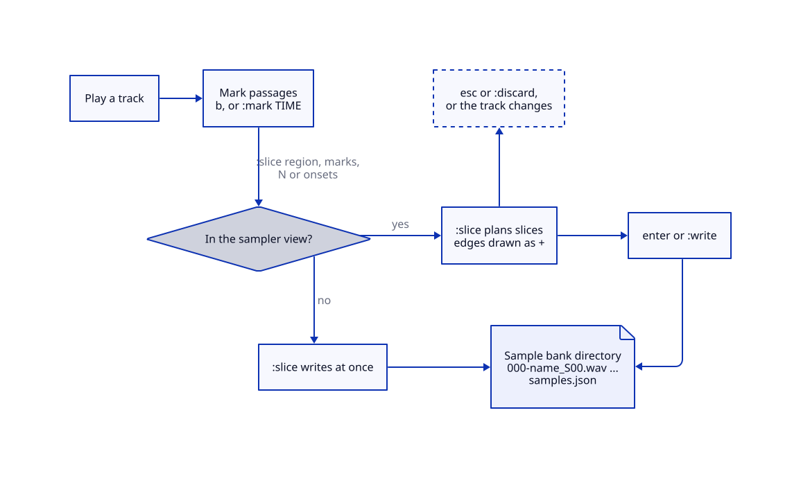
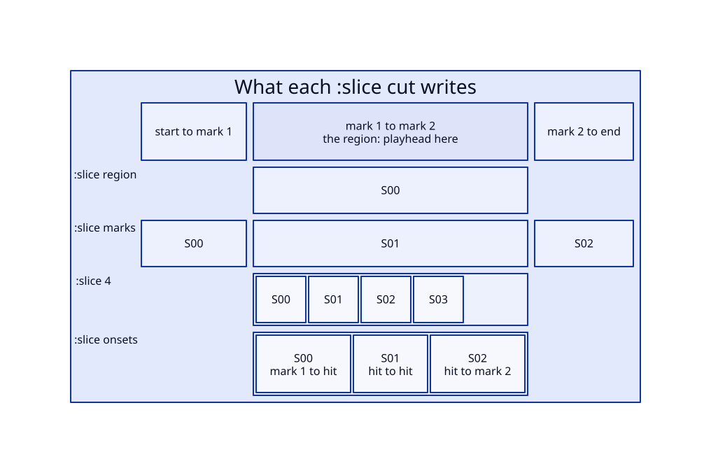

# Sampling with playr

playr marks passages of the track it is playing and cuts them into WAV files, for [rtrack](https://github.com/shakfu/rtrack) or any sampler. It does not play or trigger samples itself.

The keys and commands are listed in the README under [Marks](../README.md#marks), [Samples](../README.md#samples) and [Sampler view](../README.md#sampler-view). This page explains how the parts fit together, what an export writes, how precise it is, and what is not built yet.



## Marks and regions

A mark is a position in a track, stored in the library by file path and source frame. `b` marks the playing position; `:mark 1:23.5` marks a time.

The **region** is the span between the marks either side of the playhead. With no mark before the playhead it starts at the start of the track; with none after, it runs to the end. Seeking changes the region, so `,` and `.` (previous and next mark) choose which region a `:slice` acts on.

A **range**, set in the sampler view with `<` and `>`, `:range START END`, or a drag in the window, replaces the region while both its ends are set. It is not saved, and a change of track clears it. With a range, `:slice marks` cuts only at the marks inside it, from its start to its end.



| cut | slices |
|-|-|
| `:slice region` | 1: the region |
| `:slice marks` | the whole track, cut at every mark; the playhead does not matter |
| `:slice N` | the region in N equal parts, 2 to 256; the last part takes the remainder |
| `:slice onsets [S]` | the region, cut where hits start; `S` from 0 to 1, higher finds more |

An export holds at most 256 slices, the size of an rtrack sample bank. A cut that would make more is refused.

### Onsets

Onset detection is adapted from rtrack:

- It reads the region into memory, averaged to mono, up to 2^26 frames: about 23 minutes at 48 kHz.

- It follows the energy in 5 ms windows, in dB, so a rise from -60 to -50 dB counts as much as one from -20 to -10 dB.

- Each rise is compared with the rises around it, not with the loudest hit in the region, so one loud hit does not hide quieter ones.

- Hits are at least 50 ms apart. A hit within 50 ms of the region's start stays in the first slice.

- Each slice starts at the quietest point up to 10 ms before its hit, not partway up the attack.

Without `S`, `onset_sensitivity` from `settings.toml` applies, 0.5 by default. It is read when the slice runs, so a key bound to `slice onsets` follows the setting.

## The sampler view

`4` opens the sampler view. It draws the playing track's waveform, its marks as `|`, the playhead as `^`, and the region in the accent colour. The detail line gives the region's times to the millisecond.

- **Peaks.** The waveform is read from the file on a background thread while the view is open, the first time the view opens for a track. playr keeps the minimum, maximum and mean square of every 32 frames, and coarser levels built from them, so any zoom draws from exact values.

- **Displays.** `w` switches between three: an envelope (RMS inside peak, in eighth blocks), the same bars on a dB scale from -48 dBFS, and a Braille waveform around a centre line. The README describes when each helps.

- **Zoom.** `z` and `Z` zoom around the playhead, down to a frame a cell, or 16 points a frame in the window; `0` shows the whole track. Down to 64 frames a column, columns start on 32-frame boundaries, so a hit never shows in the column before it. Closer, the view decodes the frames it shows in the background.

- **Placing a point.** The arrows nudge the playhead a column. With `:snap on`, nudges, marks and range ends move to the nearest zero crossing within 10 ms, so a slice can start where the waveform crosses zero. Marks made in this view may be a frame apart.

- **Looping.** `l` plays the range over and over, returning to its start sample-exactly. `[` or `]` picks an end and `{` `}` move it a column, so the ends can be tuned by ear while it loops.

- **Planning.** In this view `:slice` plans instead of writing. The planned edges draw as `+` under the waveform; enter writes exactly those slices and esc discards them; with none planned, esc clears the range. A change of track discards them too. Outside the view, `:slice` plans and writes in one step.

## What an export writes

Each export makes a new directory under `samples` in `settings.toml`, `~/Music/playr/samples` by default. It is named after the track's file; a second export of the same track gets `-2`, then `-3`.

```
~/Music/playr/samples/amen/
  000-amen_S00.wav
  001-amen_S01.wav
  002-amen_S02.wav
  samples.json
```

`samples.json` records where each slice came from, in source frames, end exclusive:

```json
{
  "source": "/music/breaks/amen.flac",
  "sample_rate": 44100,
  "samples": {
    "000": { "start_frame": 0, "end_frame": 52920 },
    "001": { "start_frame": 52920, "end_frame": 105840 },
    "002": { "start_frame": 105840, "end_frame": 158760 }
  }
}
```

- **Source, not output.** Slices are read from the file, so volume and varispeed do not reach them.

- **Format.** 24-bit integer WAV at the source's sample rate and channel count. 16- and 24-bit sources are copied exactly; float and 32-bit sources are reduced to 24 bits without dither.

- **All or nothing.** An export that fails partway removes its directory, so rtrack never loads half a bank.

- **Background.** Planning and writing run on their own thread. The bottom line reports when the files are written, or why not.

## Precision

A slice is exact to the frame for the marks it was given. How close a mark is to the moment you meant depends on four things:

1. **Reaction time.** `b` marks when the key is pressed, after the sound has passed. `:mark TIME` places a mark exactly; `,` and `.` seek to a mark to check it. In the sampler view, pausing, nudging to the point and snapping remove reaction time altogether.

2. **Output latency.** The playing position counts frames handed to the audio device, not frames heard. The position runs ahead of the sound by the device buffer plus output latency, roughly 10 to 50 ms, so a mark made by ear lands that much late, on top of reaction time. That figure is inferred, not measured.

3. **Decoder offsets.** Frame 0 is after gapless trimming. For lossless formats this matches any decoder. For MP3 and AAC, another decoder may count the encoder delay differently and place the same frame up to a few thousand frames away.

4. **Varispeed.** Marks count source frames, so they stay exact at any speed.

## Not built yet

- **Hearing a region once.** A range loops; playing a region or range once and stopping is not built.

- **Marks away from the playhead in the terminal.** Marks are placed at the playhead, or at a typed time; the window also marks at a shift-click.

- **Handing a passage to a running tool.** Slices reach a sampler as files. A live tool, such as SuperCollider or Max, would rather receive a mark as it happens. Three ways were weighed:

  | option | fits | cost |
  |-|-|-|
  | One JSON line per mark, appended to a file such as `$XDG_STATE_HOME/playr/marks.jsonl` | any tool that can follow a file; a short script can forward it | smallest: no socket and no protocol to version |
  | Send-only [OSC](https://opensoundcontrol.stanford.edu/spec-1_0.html) to 127.0.0.1: `/playr/mark`, `/playr/track`, `/playr/position` | SuperCollider, Max, Pure Data, TouchOSC, Bitwig, REAPER; SuperCollider's [`Buffer.read`](https://doc.sccode.org/Classes/Buffer.html) takes a path and a frame range | a UDP socket: `playr` and `playr-gui` have none, so this would go in `playr-server`, which sends playback state as OSC already |
  | The region on the clipboard, as `amen.flac@52920+52920` | any tool, after a window switch | smallest of all, but a tool cannot react on its own |

  [MPRIS](https://specifications.freedesktop.org/mpris-spec/latest/) is Linux-only and has no marks or regions. A JSON socket like [mpv's](https://mpv.io/manual/stable/#json-ipc) needs a bridge for music tools.

  The file comes first if this is built: one key and one write settle the region format, which is the part tools depend on. A mark line would look like this:

  ```json
  {"path":"/music/breaks/amen.flac","frame":52920,"rate":44100,"channels":2,"semitones":0,"title":"Amen, Brother","artist":"The Winstons","at":"2026-09-13T21:04:11.382Z"}
  ```

  Questions still open: which tools receive this, whether a region needs separate in and out marks, and whether a region taken at +3 semitones should carry the pitch shift. Network code is settled: `playr` and `playr-gui` have none, and `playr-server` holds it; its OSC leaves `/playr/position` free for this ([server guide](server-guide.md#osc-and-touchosc)).
